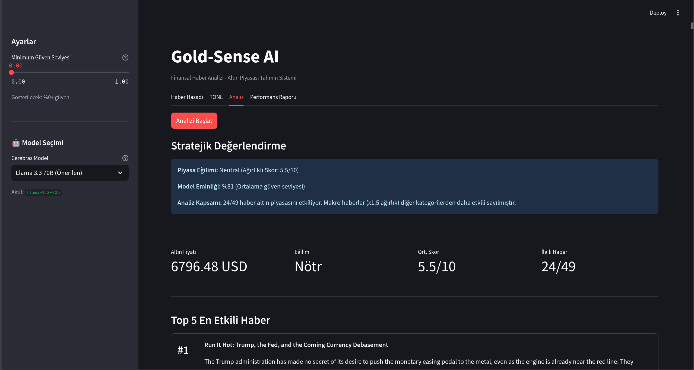

# Gold-Sense AI 🟡

**Finansal Haber Analizi ve Altın Piyasası Tahmin Sistemi**

[**🚀 CANLI DEMO**](https://gold-sense-cerebras.streamlit.app/) | [**📂 GitHub Repository**](https://github.com/SelcukOzdemir23/gold-sense)

---

## 📸 Ekran Görüntüleri

---

## 🎓 Proje Hakkında

Bu proje, yapay zeka destekli finansal analiz üzerine bir yüksek lisans çalışması kapsamında geliştirilmiştir. Temel amaç, doğal dil işleme teknikleriyle küresel finans haberlerini analiz ederek bu haberlerin altın piyasası üzerindeki olası etkilerini (olumlu/olumsuz/nötr) tahmin etmektir.

Proje, geleneksel duygu analizinden farklı olarak, haber metinlerindeki olaylar ile altın fiyatları arasındaki nedensel ilişkileri modellemeye odaklanır. Örneğin, merkez bankası faiz kararları veya jeopolitik gelişmeler gibi faktörlerin altına olan etkisini mantıksal çıkarımlarla değerlendirir.

---

## 🏗️ Sistem Mimarisi

Sistem dört ana modülden oluşur:

1. **Haber Toplama:** NewsAPI aracılığıyla altın, Fed, enflasyon, jeopolitik risk gibi anahtar kelimelerle güncel haberler çekilir.

2. **Veri Optimizasyonu:** JSON formatındaki haber verileri, TONL (Table Oriented Notation Language) formatına dönüştürülerek işlenir. Bu yöntem, API isteklerinde token kullanımını %30-50 oranında azaltır.

3. **Analiz Motoru:** Cerebras altyapısındaki Llama-3-70B modeli, DSPy kütüphanesi ile eğitilmiş bir modül üzerinden haberleri analiz eder. Modele, belirli haber türlerine nasıl tepki vereceğine dair örnekler gösterilmiş; böylece yalnızca duygu analizi değil, neden-sonuç ilişkisi kurabilmesi sağlanmıştır. Model, her haber için bir skor üretir ve bu skorun gerekçesini Türkçe olarak açıklar.

4. **Raporlama:** Tüm haber analizlerinin ağırlıklı ortalaması alınarak genel bir piyasa yönü belirlenir. Canlı altın fiyatı (Binance/Truncgil API) ile birlikte kullanıcıya sunulur.

---

## 🛠️ Kullanılan Teknolojiler

- **Yapay Zeka Motoru:** Cerebras Inference (Llama-3-70B)
- **Prompt Optimizasyonu:** DSPy
- **Veri Formatı:** TONL
- **Arayüz:** Streamlit
- **Veri Kaynakları:** NewsAPI, Binance API, Truncgil API
- **Görselleştirme:** Plotly

---

## 📂 Proje Dosyaları

- `app.py`: Uygulamanın giriş noktası, arayüz bileşenlerini çalıştırır.
- `src/goldsense/analyst.py`: DSPy tabanlı analiz motoru, modelin çağrıldığı ana modül.
- `src/goldsense/examples.py`: Modele gösterilen eğitim örneklerini içerir.
- `src/goldsense/tonl.py`: JSON verilerini TONL formatına dönüştüren araç.
- `src/goldsense/engine.py`: Analiz sonuçlarını toplayıp ağırlıklı ortalama hesaplayan motor.
- `src/goldsense/price.py`: Altın fiyatını çeken, yedekli yapıya sahip servis.

---

## 🧠 Model Eğitimi ve Çıkarım Süreci

Projede kullanılan DSPy kütüphanesi, geleneksel sabit promptlar yerine örneklemeler üzerinden modelin kendi prompt stratejisini optimize etmesini sağlar. `examples.py` içinde tanımlı senaryolar (Fed faiz kararı, savaş riski, güçlü istihdam verileri vb.) modelin hangi durumlarda nasıl mantık yürüteceğini belirler.

Örnek bir çıkarım zinciri:
- Jeopolitik gerilim haberi → Güvenli liman talebi artar → Altına talep yükselir → Fiyat artışı beklenir → **Pozitif**
- Güçlü ABD istihdam verileri → Ekonomi ısınır → Faiz indirimi zorlaşır → Altının fırsat maliyeti yükselir → **Negatif**

Bu çıkarımlar, kullanıcıya "Performans" sekmesinde detaylı olarak gösterilir.

---

## ⚠️ Yasal Uyarı

**Bu proje akademik ve eğitim amaçlıdır.** Üretilen analizler, tahminler ve skorlar yatırım tavsiyesi niteliği taşımaz. Finansal piyasalar yüksek risk içerir. Yatırım kararlarınızı kendi araştırmanıza veya lisanslı bir yatırım danışmanına dayandırmanız önerilir.

---

*Geliştirici: Selçuk Özdemir*
